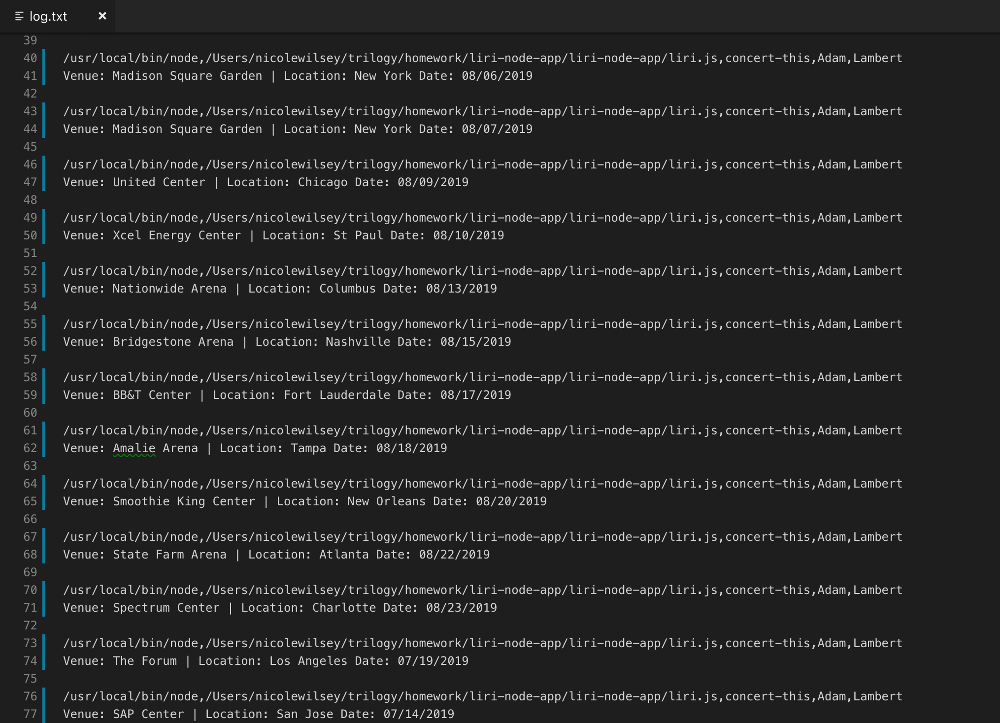

# liri-node-app

## Overview 
LIRI is a Language Interpretation and Recognition Interface application that uses node.js and the command line taking in parameters and outputting data. LIRI can search for movies, songs, concerts, and even surprise you. 

## Use 
LIRI can take in four commands outlined below. 
### movie-this  
Uses the OMDB API to to display the title, release year, IMDB Rating, country produced in, the language of the film, the short plot, and the main actors for a given movie.
Command syntax: `node liri.js movie-this bohemian rhapsody`

### spotify-this-song 
Uses the node-spotify-API to display the artist name, song name, and album name for a given song title.
Command syntax: `node liri.js spotify-this-song bohemian rhapsody`

### concert-this
Uses the Bands in Town API to display the venue, location, and date of concerts given a specified bad.
Command syntax: `node liri.js concert-this Adam Lambert`

### do-what-it-says
Uses the fs package to call `random.txt` and run whatever command is in that file.
Command syntax: `node liri.js do-what-it-says`


## Technical Aspects

As LIRI is a CLI I have provided screenshots and video below showing how the app works. You can also run it yourself by cloning the repo and creating your own .env file with the following parameters: 
```js
# Spotify API keys

SPOTIFY_ID=YOUR SPOTIFY ID HERE
SPOTIFY_SECRET=YOUR SPOTIFY SECRET HERE
```

You will also need to install the node packages that are in package.json using the "node install" command in your terminal. 

### [OMDB-API](http://omdbapi.com/)
The OMBD API requires the Axios package with a query URL and .get and the promise with a loop through the JSON response and then parsing that response to retrieve the *title*, *release year*, *IMDB rating*, *country produced in*, *language*, *plot*, and *actors*. Once a movie is searched the following will be returned: 


### [Node-Spotify-API](https://www.npmjs.com/package/node-spotify-api)
The Node-Spotify-API is "a simple to use API library for the Spotify REST API". In this application I've used the `search` method as it is the easiest way to find a track. The response is in a JSON object and multiple arrays. The properties accessed for this are *Artist*, *Song Name*, *Album Name*, and *Link to Song*. Once a song is searched the following will be returned:


### [Bands-In-Town-API](https://manager.bandsintown.com/support/bandsintown-api)
The Bands In Town API functions very similarly to the OMDB API. It requires the Axios package with a query URL and .get and the promise with a loop through the JSON response and then parsing that response to retrieve the *venue*, *location*, and *date*. Once a band is searched the following will be returned: 


### Do-What-It-Says
The "do-what-it-says" command uses the fs package to read the `random.txt` document then push it into the `spotify()` function and run it with whatever song is in the `random.txt` file. 
 

### Log.txt 
In addition to logging the data to the terminal the command run and the data received is appended to `log.txt`.




